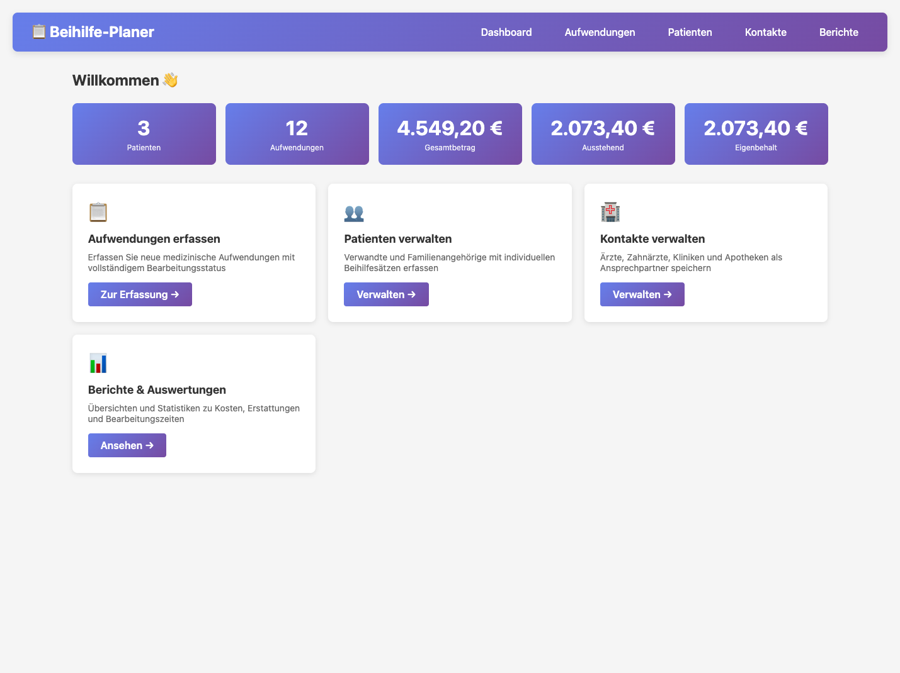
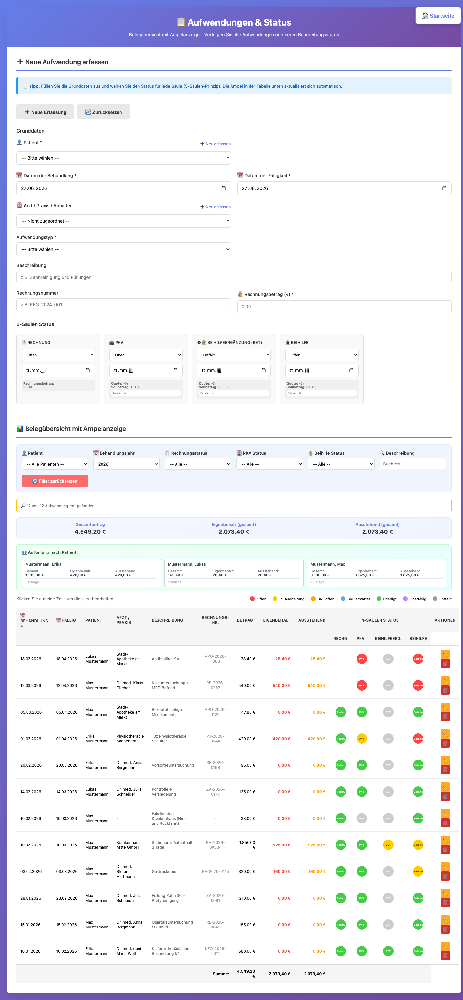
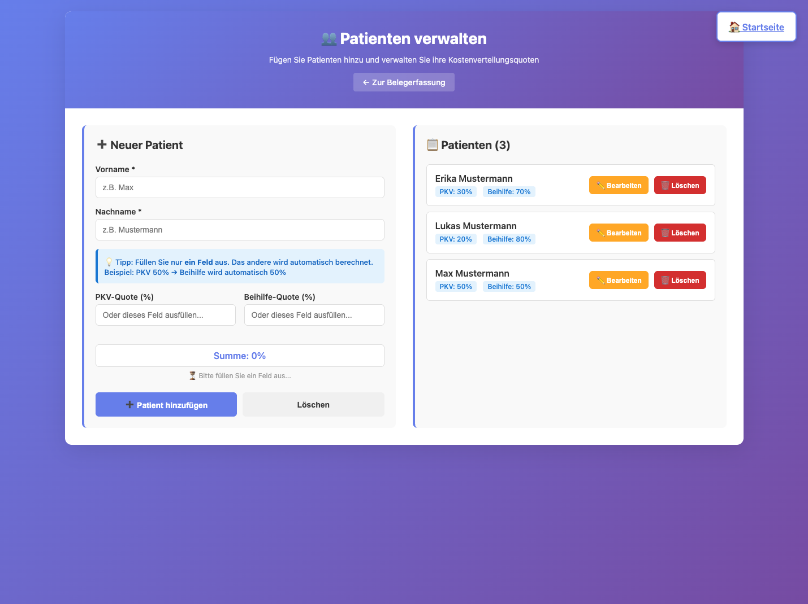
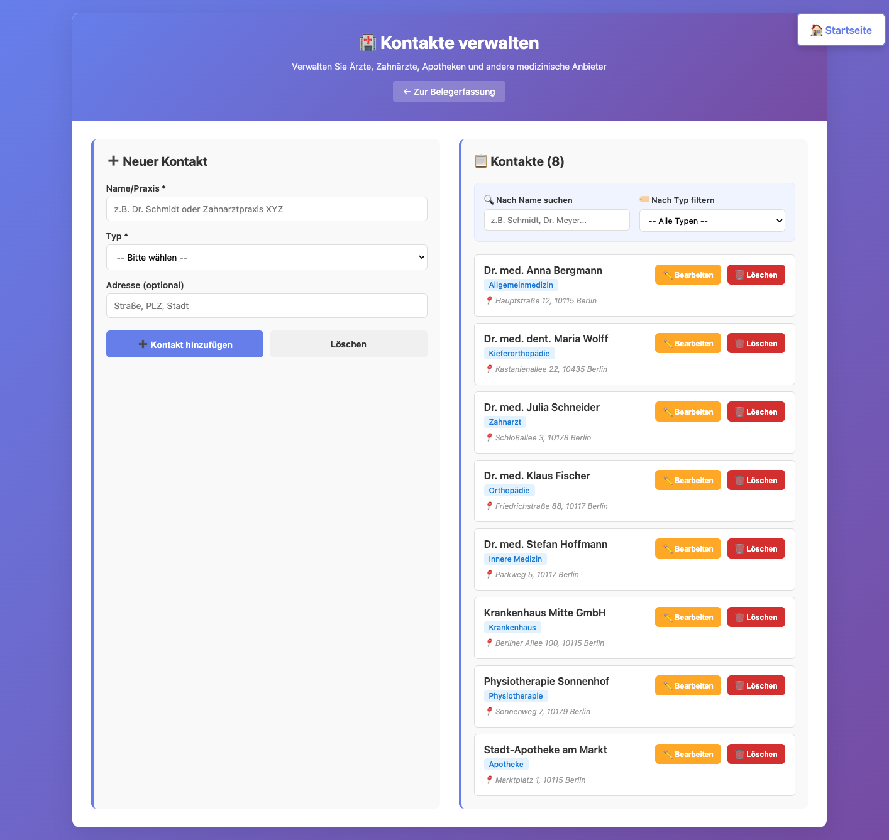
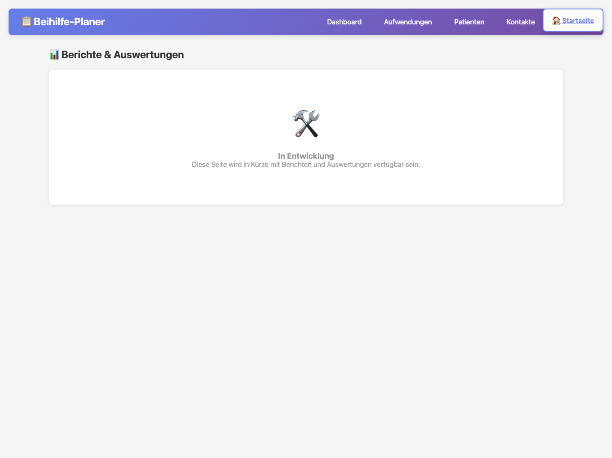

# Beihilfe-Planer

Web-Anwendung zur Erfassung und Nachverfolgung von Gesundheitskosten für Beamte mit Beihilfeanspruch und privater Krankenversicherung (PKV).

## Funktionsumfang

### Patienten

Jeder Patient (Antragsteller oder Familienmitglied) wird mit individuellen Erstattungsquoten geführt:

- **PKV-Quote** und **Beihilfe-Quote** ergänzen sich automatisch auf 100 % (Eingabe eines Werts berechnet den anderen)
- Geburtsdatum optional

### Kontakte

Ärzte, Kliniken, Apotheken und Therapeuten können als Kontakte hinterlegt werden und stehen beim Erfassen von Aufwendungen als Zuordnung zur Verfügung.

### Aufwendungen

Kern der Anwendung. Jede Aufwendung durchläuft ein **5-Säulen-System**:

| Säule | Beschreibung |
|-------|-------------|
| **Rechnung** | Eingang und Bezahlung der Originalrechnung |
| **PKV** | Einreichung und Erstattung durch die private Krankenversicherung (mit BRE-Support) |
| **Beihilfeergänzung (BET)** | Beihilfeergänzungstarif oder entfällt |
| **Beihilfe** | Staatliche Beihilfe (Antrag bei der Beihilfestelle) |

Jede Säule hat einen eigenen Status und einen Erstattungsbetrag:
- **Rechnung:** offen → eingegangen → bezahlt
- **PKV:** offen → eingereicht → BRE offen → BRE erstattet → erstattet / entfällt
- **Beihilfeergänzung (BET):** entfällt (Standard) oder offen → eingereicht → erstattet
- **Beihilfe:** offen → eingereicht → erstattet / entfällt

### Berechnung von Ausstehend und Eigenbehalt

**Zentrale Berechnungslogik** befindet sich im Backend (`calculateAmounts()` in `backend/src/db/migrations.js`). Frontend bezieht alle berechneten Werte von der API.

**Formeln:**
```
PKV ausstehend = PKV-Soll, wenn Status ∈ {offen, eingereicht}, sonst 0
Beihilfe ausstehend = Beihilfe-Soll, wenn Status ∈ {offen, eingereicht}, sonst 0

AUSSTEHEND = PKV ausstehend + Beihilfe ausstehend
             (Summe der noch zu erwartenden Erstattungen)

PKV erledigt = PKV-Soll, wenn Status = "erstattet", sonst 0
Beihilfe erledigt = Beihilfe-Soll, wenn Status = "erstattet", sonst 0

EIGENBEHALT = Betrag - PKV erledigt - Beihilfe erledigt
              (nur wenn PKV Status = "entfällt" ODER Beihilfe Status = "entfällt")
              (sonst 0 - Patient zahlt nichts, da Kostenträger zuständig)
```

**Unterstützte Aufwendungstypen:** Arzt, Zahnarzt, Apotheke, Krankenhaus, Therapie, Fahrtkosten, Parkgebühr, Sonstiges

**Farbkodierung in der Übersicht:**
- 🔴 Rot — offen/fällig
- 🟡 Gelb — eingereicht/in Bearbeitung
- 🟢 Grün — erledigt/erstattet
- ⚫ Grau — nicht zutreffend (N/A)
- 🟣 Lila — überfällig

## Technischer Aufbau

**Architektur:**
- **Frontend (nginx):** Statische HTML/CSS/JS-Seiten (Pure JavaScript, keine Frameworks)
- **Backend (Node.js + Express):** REST-API mit zentraler Berechnung
- **Datenbank (SQLite):** Schemas in `database/schema/`

**Besonderheit:** Alle Berechnungen (Ausstehend, Eigenbehalt, etc.) erfolgen **zentral im Backend**. Das Frontend verwendet nur die API-Ergebnisse – keine lokalen Berechnungen.

**Sicherheit:**
- Debug-Endpoints (`/api/aufwendungen/debug/*`) sind **nur in Development-Modus aktiviert** (`NODE_ENV === 'development'`)
- Production-Deployment setzt automatisch `NODE_ENV=production` in `docker-compose.yml`
- Keine sensiblen Daten in Debug-APIs sichtbar bei Production-Deployment

**Datenpersistenz:**
- SQLite-Datei im Docker-Volume `db_data:/data`
- Auto-Migration beim Backend-Start
- 178 Testdatensätze werden bei Bedarf migriert

### Deployment (Docker)

```bash
git clone https://github.com/Xapier/beihilfe-planer.git
cd beihilfe-planer
docker compose up -d
```

Die Anwendung ist danach erreichbar unter `http://<host>`.  
Beim ersten Start wird eine **leere Datenbank** automatisch initialisiert.

### Datenmigration aus BOP_SQL_Daten

Falls eine bestehende Access/SQLite-Datenbank (BOP_SQL_Daten.s3db) migriert werden soll:

```bash
cd migrate
npm install
node migrate_bop_corrected.js "<Pfad zur BOP_SQL_Daten.s3db>" "./beihilfe-migrated.db"
```

Anschließend die erzeugte `beihilfe-migrated.db` in das Docker-Volume einspielen.  
Detaillierte Anleitung: [migrate/MIGRATION_GUIDE.md](migrate/MIGRATION_GUIDE.md)

### Demo-Umgebung

Eine Live-Demo-Instanz mit Beispieldaten ist unter **Port 8081** verfügbar:

```bash
# Demo auf dem Server starten
ssh root@192.168.188.61
cd /opt/beihilfe-demo
docker compose up -d
```

**Demo-URL:** `http://192.168.188.61:8081`

**Beispieldaten:**
- **3 Patienten:** Max Mustermann (50/50), Erika Mustermann (30/70), Lukas Mustermann (20/80)
- **8 Kontakte:** Ärzte, Zahnärzte, Klinik, Apotheke, Physiotherapie
- **12 Aufwendungen:** Mit realistischen Status-Kombinationen für alle 4 Säulen

**Gesamt-Beispielbilanz:**
- Gesamtbetrag: **4.549,20 €**
- Ausstehend: **2.073,40 €**
- Eigenbehalt: **2.073,40 €**

Die Demo-Umgebung wird separat betrieben und beeinträchtigt nicht die Production-Datenbank auf Port 80.

## Benutzeroberfläche - User Guide

### 🏠 Dashboard

**Zweck:** Überblick über die wichtigsten Kennzahlen

**Hauptelemente:**
- **Statistik-Boxen:** Zeigen Anzahl Patienten, Aufwendungen, sowie Gesamtbetrag, Ausstehend und Eigenbehalt
- **Schnelllinks:** Direkte Navigation zu den Verwaltungs-Funktionen
- **Aktuelle Aktivitäten:** Übersicht über die letzten Transaktionen (in zukünftigen Versionen)



> **Live-Demo-Daten:** 3 Patienten (Mustermann-Familie), 12 Aufwendungen, 4.549,20 € Gesamtbetrag. Siehe Demo unter [http://192.168.188.61:8081](http://192.168.188.61:8081)

**Formatierung:**
- Alle Währungen in deutschem Format: `1.234,56 €`
- Alle Daten im Format: `DD.MM.YYYY`

---

### 📋 Aufwendungen & Status

**Zweck:** Zentrale Verwaltung aller medizinischen Aufwendungen mit dem 5-Säulen-Status-System

**Oberflächen-Bereiche:**

#### 1. **Erfassungs-Formular (oben)**
Neue Aufwendung hinzufügen:
- **Datum:** Behandlungsdatum (erforderlich)
- **Patient:** Dropdown mit registrierten Patienten
- **Kontakt:** Arzt/Zahnarzt/Klinik (optional, Dropdown)
- **Aufwendungstyp:** Arzt, Zahnarzt, Apotheke, Rechnung, etc.
- **Betrag:** Gesamtausgabenbetrag
- **Fälligkeitsdatum:** Wann muss die Rechnung bezahlt werden

#### 2. **Fünf-Säulen-Status-Panel**
Für jede Aufwendung werden 4 Status-Spalten verwaltet:

**Rechnungsstatus (Spalte 1):**
- Status: offen → eingegangen → bezahlt
- PKV-Quote: Prozentsatz für private Krankenversicherung
- Beihilfe-Quote: Prozentsatz für Beihilfe (automatisch berechnet)

**PKV-Status (Spalte 2):**
- Status: offen → eingereicht → BRE offen → BRE erstattet → erstattet / entfällt
- PKV-Erstattung: Der Betrag, den die PKV erstattet
- Mit BRE-Support (Besondere Rechnungsstelle)

**BET-Status (Spalte 3 - Beihilfe Ergänzung):**
- Status: entfällt (Standard) → offen → eingereicht → erstattet
- BET-Quote: Optional, wenn Beihilfe-Ergänzungstarif vorhanden
- Nur aktivieren, wenn Patient einen Ergänzungstarif hat

**Beihilfe-Status (Spalte 4):**
- Status: offen → eingereicht → erstattet / entfällt
- Beihilfe-Erstattung: Betrag, den der Staat erstattet
- Beihilfe-Quote wird automatisch vom Patienten-Setup übernommen

#### 3. **Automatische Berechnungen**
Nach Eingabe/Änderung werden diese Werte automatisch berechnet:
- **AUSSTEHEND:** Summe aller noch zu erwartenden Erstattungen (PKV + Beihilfe)
- **EIGENBEHALT:** Der Betrag, den der Patient selbst zahlt
- **Status-Badges:** Farbige Indikatoren für den Workflow-Status

#### 4. **Filterung & Übersicht (Belegübersicht)**
Unterhalb des Formulars:
- **Dynamische Tabelle:** Zeigt gefilterte Aufwendungen mit allen Statusabschnitten
- **Spalten:**
  - Datum / Fälligkeitsdatum
  - Betrag, Ausstehend, Eigenbehalt
  - PKV-Soll, Beihilfe-Soll
  - Status-Indikatoren für jede Säule
- **Tooltips:** Hover über einen Betrag zeigt die Details (Daten, Status, berechnete Werte)
- **Farbmarkierung:** Reihen werden nach Status gefärbt
  - 🔴 Offen/Fällig
  - 🟡 In Bearbeitung
  - 🟢 Erledigt
  - ⚫ N/A (nicht zutreffend)

#### 5. **Aufteilung nach Patient**
Darunter: Zusammenfassung der Aufwendungen pro Patient
- Gesamtbetrag pro Patient
- Ausstehend pro Patient  
- Eigenbehalt pro Patient



> **Live-Demo-Daten:** Zeigt 12 Aufwendungen mit verschiedenen Status-Kombinationen (alle Säulen offen, teilweise erledigt, BET aktiv, etc.). Datum-Format DD.MM.YYYY, Währung mit Tausender-Trennzeichen (z.B. 1.234,56 €).

---

### 👥 Patienten Verwaltung

**Zweck:** Verwaltung von Antragstellern und Familienangehörigen

**Funktionen:**
- **Neuer Patient hinzufügen:**
  - Name (erforderlich)
  - Geburtsdatum (optional)
  - PKV-Quote: % der Kosten, die PKV übernimmt
  - Beihilfe-Quote: % der Kosten, die Beihilfe übernimmt (automatisch berechnet auf 100%)

- **PKV ↔ Beihilfe-Auto-Berechnung:**
  - Eingabe "PKV-Quote: 50%" → Beihilfe-Quote wird automatisch auf 50% gesetzt
  - Eingabe "Beihilfe-Quote: 70%" → PKV-Quote wird automatisch auf 30% gesetzt

- **Patienten-Liste:**
  - Alle registrierten Patienten mit ihren Quoten
  - Edit-Button zum Ändern der Daten
  - Delete-Button zum Löschen (Vorsicht: Löscht auch verknüpfte Aufwendungen)

**Besonderheit:** Die Patient-Quotes werden bei der Aufwendungs-Erfassung als Default-Wert übernommen, können aber pro Aufwendung überschrieben werden.



> **Live-Demo-Daten:** Zeigt 3 Demo-Patienten mit unterschiedlichen PKV/Beihilfe-Quoten (50/50, 30/70, 20/80). Auto-Berechnung der Gegenquote funktioniert live in der Demo.

---

### 🏥 Kontakte Verwaltung

**Zweck:** Verwaltung von Ärzten, Zahnärzten, Kliniken, Apotheken, etc.

**Funktionen:**
- **Neuer Kontakt hinzufügen:**
  - Name (erforderlich)
  - Kontakttyp: Arzt, Zahnarzt, Klinik, Apotheke, Therapeut, Sonstiges
  - Adresse (optional)
  - Telefon (optional)
  - Email (optional)

- **Kontakt-Liste:**
  - Alle Kontakte mit ihrem Typ und Details
  - Suchfunktion zum Filtern nach Name
  - Edit-Button zum Ändern
  - Delete-Button zum Löschen

**Verwendung:** Bei der Aufwendungs-Erfassung können Kontakte als "Arzt/Klinik" zugeordnet werden. Dies hilft bei der Nachverfolgung, welche Behandlungen bei welchem Provider erfolgt sind.



> **Live-Demo-Daten:** 8 Demo-Kontakte (Ärzte, Zahnärzte, Klinik, Apotheke, Physiotherapie) mit Typisierung und Adressangaben. Such- und Filter-Funktionen aktiv.

---

### 📊 Berichte & Auswertungen

**Zweck:** Analysen und Übersichten für Finanzbuchhaltung und Verhandlungen

**Verfügbare Berichte (geplant für zukünftige Versionen):**
- **Kostenübersicht:** Gesamtkosten nach Patient, Aufwendungstyp, Zeitraum
- **Erstattungsübersicht:** Wie viel PKV und Beihilfe erstattet haben
- **Ausstehend-Report:** Offene Forderungen gegen PKV und Beihilfe
- **Überfällig-Report:** Rechnungen/Anfragen, die zu lange offen sind
- **Export-Funktionen:** CSV/PDF für Weiterverarbeitung in Excel/Buchhaltung



> *Seite ist in Entwicklung. Screenshot zeigt zukünftiges UI-Layout.*

---

## Datenbankschema

Siehe [database/schema/01_core_tables.sql](database/schema/01_core_tables.sql)

**Haupttabellen:**
- `patients` — Patienten mit PKV/Beihilfe-Quoten
- `aufwendungen` — Einzelne Medizinische Aufwendungen  
- `aufwendung_berechnungen` — Berechnete Werte (ausstehend, eigenbehalt, etc.)
- `contacts` — Ärzte, Kliniken, etc.

**Datenschutz:**
- Keine automatischen Backups im Repository
- SQLite-Datei wird in Docker-Volume gespeichert (nicht in Git)
- Bei Datenmigration: Ensure compliance mit DSGVO

## Tipps & Best Practices

### Workflow - Vom Arztbesuch zur Erstattung

1. **Rechnung kommt an:**
   - Neue Aufwendung anlegen mit Datum, Arzt, Betrag
   - Status "Rechnungsstatus" auf "eingegangen" setzen

2. **Rechnung bezahlen:**
   - Status "Rechnungsstatus" auf "bezahlt" setzen

3. **Bei PKV einreichen:**
   - Status "PKV" auf "eingereicht" setzen
   - PKV-Erstattungsbetrag eintragen (wenn bekannt)

4. **PKV erstattet:**
   - Status "PKV" auf "erstattet" setzen
   - System berechnet automatisch Eigenbehalt

5. **Bei Beihilfe einreichen:**
   - Status "Beihilfe" auf "eingereicht" setzen
   - Beihilfe-Erstattungsbetrag eintragen (wenn bekannt)

6. **Beihilfe erstattet:**
   - Status "Beihilfe" auf "erstattet" setzen
   - Aufwendung ist damit abgeschlossen

### Szenarien

**Szenario 1: PKV zahlt, Beihilfe entfällt**
- Rechnungsstatus: bezahlt
- PKV: erstattet (mit Betrag)
- Beihilfe: entfällt
- Eigenbehalt: Betrag - PKV-Erstattung

**Szenario 2: Nur Beihilfe zuständig**
- Rechnungsstatus: bezahlt
- PKV: entfällt (z.B. für Zahnersatz, über Grenze)
- Beihilfe: eingereicht
- Eigenbehalt: Betrag - Beihilfe-Erstattung

**Szenario 3: Rechnung wird geteilt**
- Patient zahlt zunächst selbst
- PKV und Beihilfe teilen sich die Kosten
- Eigenbehalt: 0 (wenn gesamt von PKV+Beihilfe gedeckt)

---

## Lizenz

Siehe [LICENSE](LICENSE)
